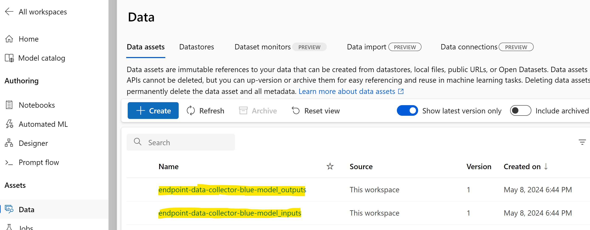
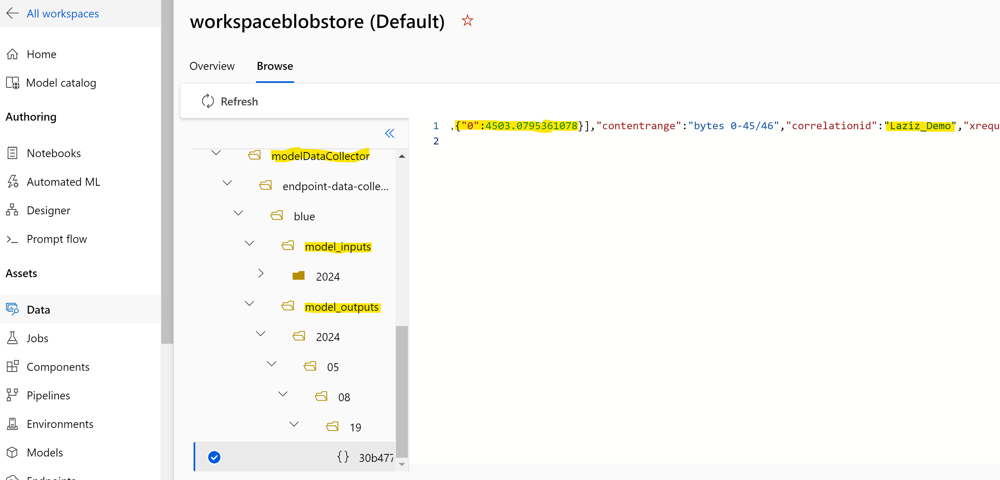

# Inference data collection from Azure ML managed online endpoints

As described in [Azure ML documentation](https://learn.microsoft.com/en-us/azure/machine-learning/how-to-collect-production-data), you can _azureml-ai-monitoring_ Python package to collect real-time inference data received and produced by your machine learning model, deployed to Azure ML managed online endpoint.

This repo provides all the required resources to deploy and test a Data Collector solution end-to-end.

## 1 - Dependency files
Successful deployment depends on the following 3 files, borrowed from the original [Azure ML examples](https://github.com/Azure/azureml-examples/tree/main/sdk/python/endpoints/online/model-1) repo: _inference model_, _environment configuration_ and _scoring script_.

### 1.1 - Inference model
**_sklearn_regression_model.pkl_** is a SciKit-Learn sample regression model in a pickle format. We'll re-use it "as is".

### 1.2 - Environment configuration
**_conda.yaml_** is our Conda file, to define running environment for our machine learning model. It has been modified to include the following AzureML monitoring Python package.
```
azureml-ai-monitoring
```

### 1.3 - Scoring script
**_score_datacollector.py_** is a Python script, used by the managed online endpoint to feed and retrieve data from our inference model. This script was updated to enable data collection operations.

_Collector_ and _BasicCorrelationContext_ classes are referenced, along with the _pandas_ package. Inclusion of pandas is crucial, as Data Collector at the time of writing was able to log directly only DataFrames.
``` Python
from azureml.ai.monitoring import Collector
from azureml.ai.monitoring.context import BasicCorrelationContext
import pandas as pd
```

_init_ function initialises global Data Collector variables.
``` Python
global inputs_collector, outputs_collector, artificial_context
inputs_collector = Collector(name='model_inputs')          
outputs_collector = Collector(name='model_outputs')
artificial_context = BasicCorrelationContext(id='Laziz_Demo')
```

"_model_inputs_" and "_model_outputs_" are reserved Data Collector names, used to auto-register relevant Azure ML data assets.


_run_ function contains 2 data processing blocks. First, we convert our input inference data into pandas DataFrame to log it along with our correlation context.
``` Python
input_df = pd.DataFrame(data)
context = inputs_collector.collect(input_df , artificial_context)
```

The same operation is then performed with the model's prediction to log it in the Data Collctor's output.
``` Python
output_df = pd.DataFrame(result)
outputs_collector.collect(output_df, context)
```

## 2 - Solution deployment and testing
To deploy and test Data Collector, you can execute cells in the provided Jupyter notebook.

### 2.1 - System configuration
You would need to set values of your Azure subscription, resource group and Azure ML workspace name.
``` Python
subscription_id = "<YOUR_AZURE_SUBSCRIPTION>"
resource_group_name = "<YOUR_AZURE_ML_RESOURCE_GROUP>"
workspace_name = "<YOUR_AZURE_ML_WORKSPACE>"
```

### 2.2 - Model deployment options
You may upload local model for initial testing (Option 1).
``` Python
model = Model(path = "./model/sklearn_regression_model.pkl")
```

However, recommended and more robust option is to register the model in your Azure ML (Option 2), as it provides better management control, eliminates model's re-upload and enables more controlled reproducibility of the testing results.
``` Python
file_model = Model(
    path="./model/",
    type=AssetTypes.CUSTOM_MODEL,
    name="scikit-model",
    description="SciKit model created from local file",
)
ml_client.models.create_or_update(file_model)
```

### 2.3 - Model and environment references
Ensure that you refer the right version of your registered inference model and environment.
``` Python
model = "scikit-model:1"
env = "azureml:scikit-env:2"
```

### 2.4 - Activation of Data Collector objects
You need to enable explicitly both input and output collectors, referred in the scoring script.
``` Python
collections = {
    'model_inputs': DeploymentCollection(
        enabled="true",
    ),
    'model_outputs': DeploymentCollection(
        enabled="true",
    )
}

data_collector = DataCollector(collections=collections)
```

Those values can be passed then to _data_collector_ parameter of **_ManagedOnlineDeployment_**.
``` Python
deployment = ManagedOnlineDeployment(
    ...
    data_collector=data_collector
)
```

### 2.5 - Testing data collection process with sample request data
Once the inference model is deployed to managed online endpoint, you can test data logging with provided _sample-request.json_ file.
``` Python
ml_client.online_endpoints.invoke(
    endpoint_name=endpoint_name,
    deployment_name="blue",
    request_file="./sample-request.json",
)
```

Logged inference data can be found in **_workspaceblobstore (Default)_**, unless you define custom paths for the input and output data collectors in Step 2.4 above.

